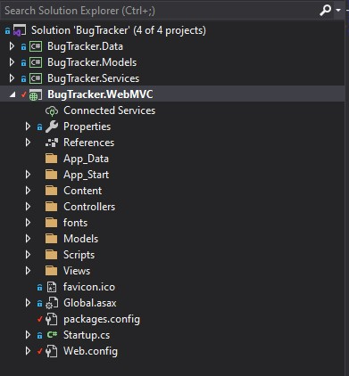

# Bug Tracker
#### A new tool developed to create tickets for things to address

## Description

This app currently has two user roles. A normal user can create tickets, comment on tickets, and add attachments to thier tickets.
They can also only edit only things they created.
An Admin user can see everyones tickets and perform crud functionality for everything.
I hope to expand this in time and make it a more full functioned app. I want to add a notification system along with other user roles. I want to add an archive function. I also want to add a reply function and update the comment section. 
It is a work in progress.

## Technologies used

*  Git Hub
*  C#, Html , CSS, BootStrap, .NET
*  [Visual Studio 2019 Community](https://visualstudio.microsoft.com/downloads/)
*  [BootSwatch](https://bootswatch.com/)
*  [Trello](https://trello.com/b/KSftAe0z/bugtracker)
*  [dbgiagram.io](https://dbdiagram.io/embed/60d4c7b0dd6a5971481e625d)

# Bug Tracker Project Layout

#### This project in a N-teir solution that utilizes the MVC design

## Data: 

#### This layer houses our classes that relate to the Database

## Models:

#### This layer houses our reusable models for the rest of the layers

## Services:

#### This contains most of the working code that allows us to perform our CRUD functions

## Web MVC:

#### This is where the controllers and views are located for our webpage and database

## Installation

Click on the green code button    at the top right and select clone or download the zip file.   
It is easiest to use Visual Studio 2019 Community.  Download VS free [HERE](https://visualstudio.microsoft.com/downloads/) 

## Contributing
To contribute to this project, follow the instructions for cloning, then commit your code or changes on a new branch.  Please be sure to include unit test before making a pull request.

## Creator
This project was designed and developed by James Campbell.

